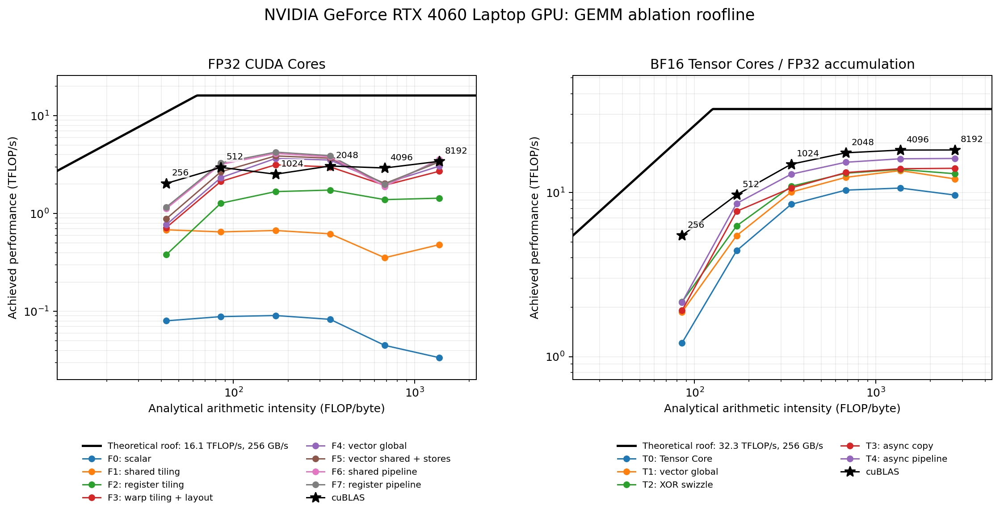
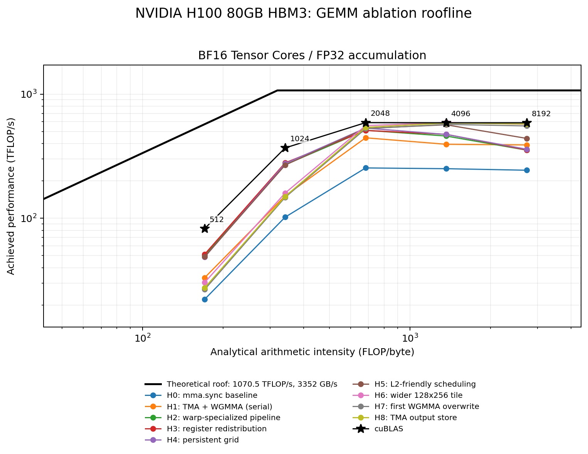

# gpu-kernels

Hand-written CUDA kernels benchmarked against established libraries. Times are in microseconds; **reference % = reference time / custom time × 100**. Results below are from the latest matching runs recorded in this project.

## GEMM — SM89 (RTX 4060 Laptop)

[`kernels/gemm/matmul/sm89.cu`](kernels/gemm/matmul/sm89.cu) implements FP32 CUDA-core and BF16 Tensor Core GEMM (TN layout).

| M=N=K | dtype | custom µs | cuBLAS µs | reference % |
| ---: | :--- | ---: | ---: | ---: |
| 2048 | FP32 | 2600.45 | 2546.98 | 97.9 |
| 2048 | BF16 | 755.92 | 644.02 | 85.2 |

- FP32: block/warp/thread tiling, register accumulation, `float4` loads, shared-memory double buffering.
- BF16: `mma.sync`, `ldmatrix`, XOR swizzling, two-stage `cp.async` buffering.

## GEMM — SM90 (H100 SXM)

[`kernels/gemm/matmul/sm90.cu`](kernels/gemm/matmul/sm90.cu) implements BF16 persistent WGMMA GEMM. These are the latest reported results for the current Kernel 10 version.

| M=N=K | custom µs | cuBLAS µs | reference % |
| ---: | ---: | ---: | ---: |
| 2048 | 30.53 | 27.59 | 90.4 |
| 4096 | 227.58 | 219.14 | 96.3 |
| 8192 | 1794.82 | 1807.82 | 100.7 |

- TMA loads/stores, WGMMA, three-stage shared-memory pipeline, persistent tile scheduling, shared-memory output epilogue.

## GEMM ablation: analytical rooflines

Each curve compares incremental kernel optimizations with cuBLAS. Throughput comes
from measured CUDA Graph runtimes; arithmetic intensity uses minimum algorithmic
IO, not measured DRAM traffic. The roofs use theoretical bandwidth and dense
compute throughput at the sampled active GPU clock. Matrix sizes label cuBLAS
points; these plots do not establish actual memory traffic or bottlenecks.

### SM89: RTX 4060 Laptop

FP32 stages F0-F7 and BF16 stages T0-T4 cover tiling, vectorized access, swizzling,
and asynchronous pipelines, with square matrices from 256 to 8192. Stage files
are in [`ablation/sm89_fp32/`](ablation/sm89_fp32/) and
[`ablation/sm89_bf16/`](ablation/sm89_bf16/).



### SM90: H100

BF16 stages H0-H8 cover TMA/WGMMA, warp specialization, register redistribution,
persistent scheduling, L2-friendly scheduling, wider tiles, accumulator overwrite,
and TMA output stores, with square matrices from 512 to 8192. Stage files are in
[`ablation/sm90_bf16/`](ablation/sm90_bf16/). Some transitions change tile size and
queue depth together; improvements are not necessarily monotonic.



## FlashAttention forward

[`kernels/attention/flash_attention/`](kernels/attention/flash_attention/) contains causal BF16, head-dimension-128 MHA/GQA/MQA kernels for SM89 and SM90. Tables show MHA only. Latest reported RTX 4060 run: `B=1, T=512, Hq=Hkv=8, D=128`.

| Hkv | custom µs | FlashAttention-2 µs | reference % |
| ---: | ---: | ---: | ---: |
| 8 (MHA) | 32.06 | 34.16 | 106.5 |

- SM89: fused QK/online-softmax/PV, causal-tile specialization, `cp.async` prefetch, `ldmatrix`.
- SM90: raw CUDA/PTX TMA/WGMMA forward; the optimized H100 results are below.

### H100 MHA against official FlashAttention-4

Latest saved paired FA4 run on NVIDIA H100 80GB HBM3 (SXM): fixed `B=4`,
`Hq=Hkv=8`, `D=128`. Both implementations use causal BF16 inputs/output
and FP32 natural-log LSE. Times are medians of 15 trials
after 1 second of warmup, measured with CUDA Graph replay; setup and Python
API latency are excluded.

This FA4 run uses an earlier kernel snapshot; the latest kernel has only
been remeasured against FA3. Values below are from the same paired FA4 run,
not a mixture of separate benchmarks.

| size | dtype | operation | custom µs | reference (FA4) µs | reference % |
| :--- | :--- | :--- | ---: | ---: | ---: |
| B=4,T=512,Hkv=8 | BF16 | forward | 10.47 | 9.79 | 93.5 |
| B=4,T=1024,Hkv=8 | BF16 | forward | 25.44 | 24.69 | 97.0 |
| B=4,T=2048,Hkv=8 | BF16 | forward | 83.69 | 81.94 | 97.9 |
| B=4,T=4096,Hkv=8 | BF16 | forward | 275.05 | 273.11 | 99.3 |
| B=4,T=8192,Hkv=8 | BF16 | forward | 1023.66 | 962.41 | 94.0 |

This run reaches ≥95% of FA4 throughput on **3/5 MHA shapes**.

## MegaMoE

The current code is the **unfused BF16 baseline**, using DeepEP dispatch/combine,
two DeepGEMM expert GEMMs, and a custom CUDA SwiGLU kernel. The fused persistent
MegaMoE kernel is not implemented yet. Distributed runs require two or four H100
GPUs on one NVLink-connected node with DeepEP and DeepGEMM installed.

## Run

```bash
uv sync --locked
bash scripts/test.sh all
bash scripts/benchmark.sh matmul quick
bash scripts/benchmark.sh flash_attention quick
GPU_KERNELS_CUDA_ARCH=90 bash scripts/benchmark.sh matmul h100
GPU_KERNELS_CUDA_ARCH=90 bash scripts/benchmark.sh flash_attention h100 --reference fa2
GPU_KERNELS_CUDA_ARCH=90 bash scripts/benchmark.sh flash_attention h100 --reference fa3
GPU_KERNELS_CUDA_ARCH=90 bash scripts/benchmark.sh flash_attention h100 --reference all --trials 15 --sample-ms 40
bash scripts/benchmark_moe.sh 2 --check
```

`all` covers the single-GPU GEMM and FlashAttention suites. The distributed MoE
baseline has its own launcher. Runtime reports are overwritten in
`profiles/runtime/`; Nsight reports use `bash scripts/profile.sh FAMILY quick`.
